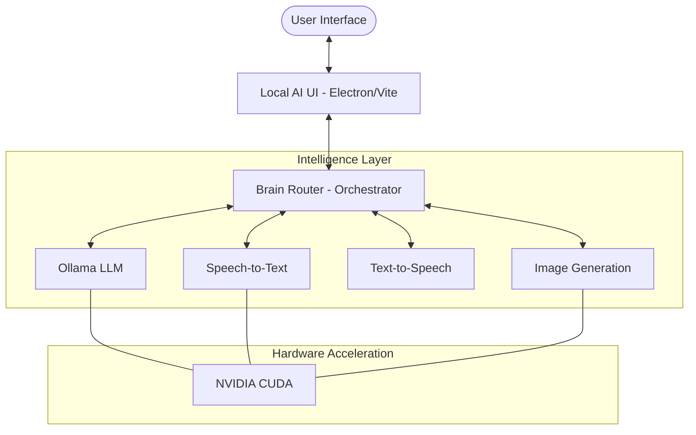

# 🤖 Local AI Assistant

[](https://opensource.org/licenses/MIT)
[](https://www.python.org/downloads/)
[](https://www.electronjs.org/)
[](https://ollama.ai/)

> **A powerful, private, and modular AI ecosystem running entirely on your local machine.**

Local AI Assistant is a sophisticated orchestration platform that integrates LLMs (via Ollama), Speech-to-Text (STT), Text-to-Speech (TTS), and Image Generation into a unified, agentic interface. Built for performance and privacy, it bypasses the cloud to give you full control over your intelligence.

---

## ⚡ Quick Start

### The "One-Click" Experience (Windows)
Simply run the bootstrap script to launch the entire ecosystem:
```bash
./LAUNCH_CODEX.bat
```

---

## 🏗️ Architecture



---

## 🌟 Key Features

| Component | Technology | Capability |
| :--- | :--- | :--- |
| **Orchestrator** | Python / FastAPI | Intelligent routing & service management |
| **Brain UI** | React / Electron | Modern, responsive dashboard |
| **Intelligence** | Ollama | Llama 3, Mistral, and custom models |
| **Perception** | OpenAI Whisper | High-accuracy local speech recognition |
| **Vocal** | Edge-TTS / Piper | Natural-sounding local speech synthesis |
| **Creativity** | Stable Diffusion | Local high-resolution image generation |

---

## 📁 Project Structure

*   **`local-ai-assistant/`**: The neural core. Python-based microservices and orchestration.
*   **`local-ai-ui/`**: The visual cortex. Electron/React dashboard for interacting with the assistant.
*   **`scripts/`**: Automation and deployment utilities.
*   **`data/`**: Local memory and processing storage.

---

## 🛠️ Setup & Restoration (One-Click)

Because AI models and virtual environments are large, they are excluded from this repository. We've automated the entire setup process.

### 1. Clone
```bash
git clone https://github.com/Galactic717/local-ai-assistant.git
cd local-ai-assistant
```

### 2. Automatic Install
Run the installer to setup Python venv, install dependencies (pip & npm), and pull AI models:
```bash
# Windows (Double-click or run in terminal)
.\INSTALL.bat
```

### 3. Launch
Once the installer finishes, launch the entire ecosystem:
```bash
.\LAUNCH_CODEX.bat
```

---

## 🏗️ Manual Setup (Advanced)
If you prefer to setup components individually:
1. **Models:** Run `.\scripts\restore_models.bat` to pull Ollama models.
2. **Backend:** In `local-ai-assistant/`, run `python -m venv venv`, activate it, and `pip install -r requirements.txt`.
3. **Frontend:** In `local-ai-ui/`, run `npm install`.


---

## 🤝 Contributing

We welcome contributions! Please see [CLAUDE.md](./CLAUDE.md) for project standards and development workflows.

---

## 📜 License

This project is licensed under the MIT License - see the [LICENSE](LICENSE) file for details.
